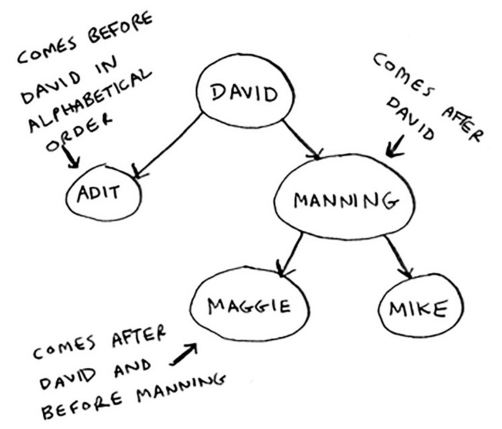
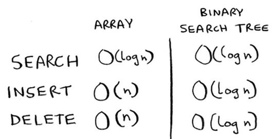
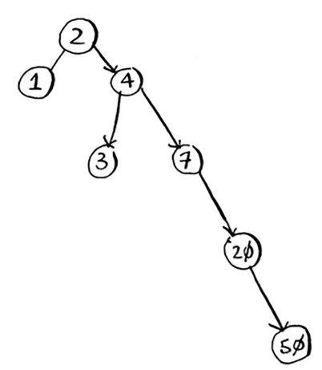

Binary trees
=====

The main intuition behind binary search trees are mainly that **whenever you do binary search, you have to add and then sort the array. That's inefficient.**

For every node, the nodes on the left of it have a lower value while the ones on the right are a lot larger in value.

So, if I wanted to search for Maggie, I'd follow: **David → Manning → *Maggie*!**

.. Important:: *"Searching for an element in a binary search tree takes O(log n) time on average and O(n) time in the worst case. Searching a sorted array takes O(log n) time in the worst case, so you might think a sorted array is better. But a binary search tree is a lot faster for insertions and deletions on average."*

Some of the main downsides of binary trees are that you don't get random access (indexing). The performance of a tree rely fully on **how balanced the tree is.** Look at the tree below:

Some trees are also able to balance themselves, like the red-black tree. B-trees are used in storing data in databases.