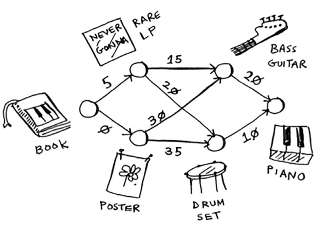
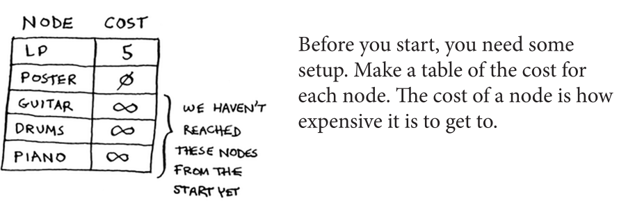
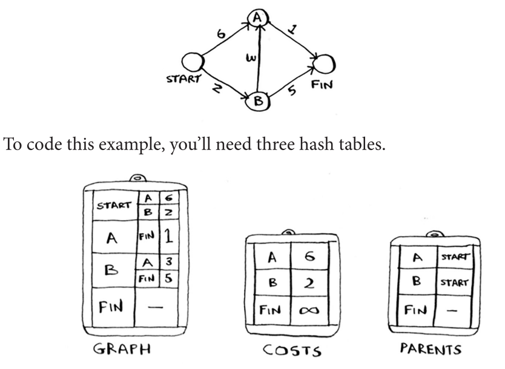

Dijkstra's Algorithm
=====

4 main steps:

1. Find the "cheapest" node. This is generally the node that you can get to with the shortest cost
2. Update the costs of the neighbours of the node.
3. Repeat this until you've done this for every node in the graph.
4. Calculate the final path

*"In the last chapter, you used breadth-first search to find the shortest path between two points. Back then, “shortest path” meant the path with the fewest segments. But in Dijkstra’s algorithm, you assign a number or weight to each segment. Then Dijkstra’s algorithm finds the path with the smallest total weight."*

Each edge in the graph has a number associated it, **known as weights (**graphs with weights are known as weighted graphs, unweighted for no weights).

Whenever dealing with unweighted graphs, **breadth-first** works. For weighted ones, **Dijkstra's algorithm.**

Here's an example of trading a **piano book → actual piano:**

We work in **hierarchies.** That means the first section (**parent column)** would be the the book as **that's the parent for the poster + rare LP.**

What are the trades he needs to make?

We can also use **negative signs** when we want to show situations **where we get something back** (ex. I get paid back $7 for getting some item).

The only concern? **Dijkstra's algorithm doesn't support negative weights.**

What do we do? **Use the Bellman-Ford algorithm** (outside scope of this guide).

What the algorithm looks like?

In code
------------

.. code-block:: python
   :linenos:
   def find_lowest_cost_node(costs):
        lowest_cost = float(“inf”)
        lowest_cost_node = None
        for node in costs:
	        cost = costs[node]
	        if cost < lowest_cost and node not in processed:
		        lowest_cost = cost
		        lowest_cost_node = node
        return lowest_cost_node
   node = find_lowest_cost_node(costs)
   while node is not None:
        cost = costs[node]
        neighbors = graph[node]
        for n in neighbors.keys():
	     new_cost = cost + neighbors[n]
	     if costs[n] > new_cost: #we want to reduce + lower the cost
		costs[n] = new_cost
	        parents[n] = node
        processed.append(node)
   node = find_lowest_cost_node(costs)