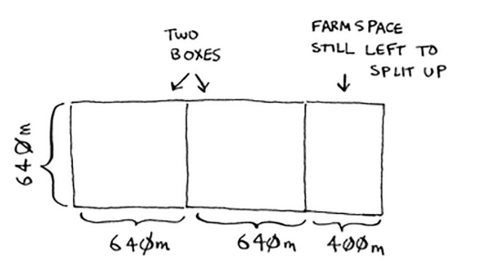
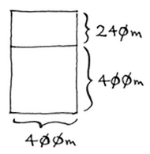
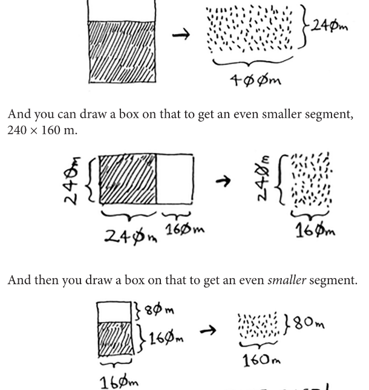
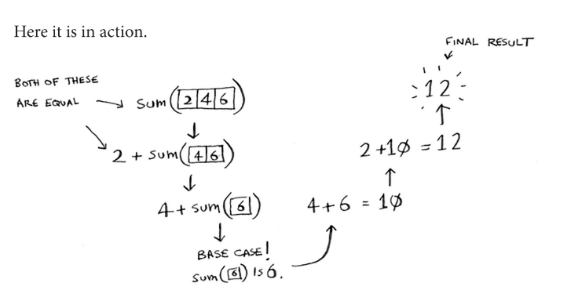

Divide and Conquer
=====

Divide and Conquer is generally used in situations where you need to solve a problem that **can't be solved with the existing algorithms you've learned.**

It can also be known as a **recursive technique** used to solve these problems. Think of D&C like this whole new framework used for solving problems.

Let's say that we have this farm:

You cut the 1680x640 farm into 2 squares, each of length 640. **Now your problem is that you need to split up the smaller segment (640x400).** 

If you find the biggest box for that size (640x400), **then that'll be the biggest box which will work for the entire farm!** Notice how you reduced the problem from a 1680x640 farm to a 640x400 farm.

And now, you simply apply the algorithm again and again until you find the perfect case.

So for recap, D&C can be broken down into 2 main steps:

1. Figure out a simple case as the base case
2. Figure out how to reduce your problem and get to the base case.

.. Important:: Remember that D&C isn't a simple algorithm that you can apply to a problem. Instead, it's a framework that you can use to think about a problem.

Here's array summing in recursion:

This is known as **functional programming** (Haskell).
