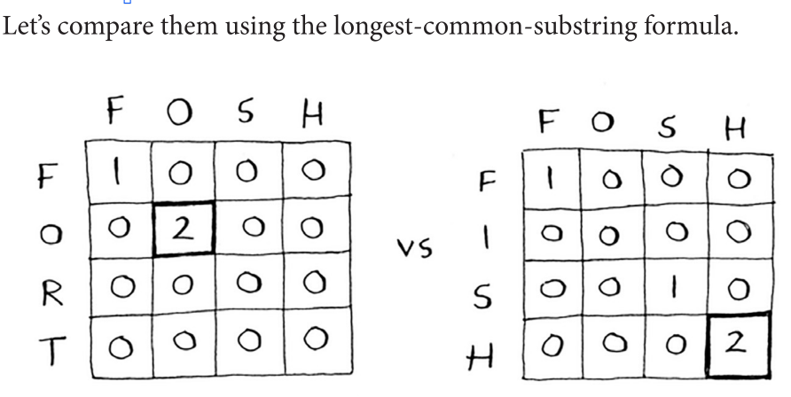

Dynamic Programming
=====

We talked about in the previous page (greedy algorithms) that sometimes, we can only come up with an **approximate solution.** But is it even possible to find + calculate the optimal solution? That's where dynamic programming comes in.

Dynamic programming is essentially this method to be able to **solve subproblems that build up to solving the big problem.**

The knapsack problem
------------

.. figure:: images/32.png
   :align: center

.. Important:: **Every dynamic problem starts with some sort of grid**, here's a grid for the knapsack problem:

The question that the grid is trying to answer is **if your knapsack had capacity *x* lb, what is the maximum value that you can put in that bag?**

As you fill through the table, this is what you end up becoming at:

Notice that as you go through the rows, the predictions become more refined; you're iterating over your estimates as you go through the items.

According to your last best estimate, the best item you can put in there for that 1lb space is the guitar. This is what your now final grid looks like!

What does that look like as a formula?

The biggest question that pops up in your mind is **can the value of a column ever go down?** 

**NO.** At every iteration, you're storing the current maximum estimate. That estimate that you get will never be worse than what it was before. Same thing with the order of the table, **it makes no impact.**

What about dealing with fractions of items? **That wouldn't work, dynamic programming allows you to only take the item or not.** Instead, you can solve this with a **greedy algorithm!** Take as much as you can of one item, when that runs out, take as much as you can of the next most valuable item, and so on.

.. Important:: "*Dynamic programming is useful when you’re trying to optimize something given a constraint. In the knapsack problem, you had to maximize the value of the goods you stole, constrained by the size of the knapsack."* 

General tips for dynamic solutions:

1. Every dynamic-programming solution involves a grid.
2. The values in the cells are usually what you’re trying to optimize. For the knapsack problem, the values were the value of the goods.
3. Each cell is a subproblem, so think about how you can divide your problem into subproblems. That will help you figure out what the axes are.

Longest common subsequence
------------

**Suppose Alex accidentally searched for fosh. Which word did he mean: fish or fort?**

That isn't gonna work. Let's redo the algorithm:

Notice how it works in a diagram "way". When a new match is found, that row + column is filled with that max value until another match is found.

Applications of dynamic programming
------------

1. Biologists use the longest common subsequence to find similarities in DNA strands. They can use this to tell how similar two animals or two diseases are. The longest common subsequence is being used to find a cure for multiple sclerosis. 
2. Have you ever used diff (like git diff)? Diff tells you the differences between two files, and it uses dynamic programming to do so. 
3. We talked about string similarity. Levenshtein distance measures how similar two strings are, and it uses dynamic programming. Levenshtein distance is used for everything from spell-check to figuring out whether a user is uploading copyrighted data.

