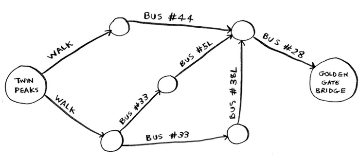
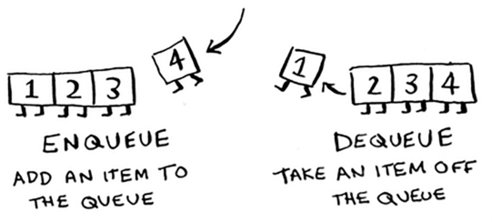
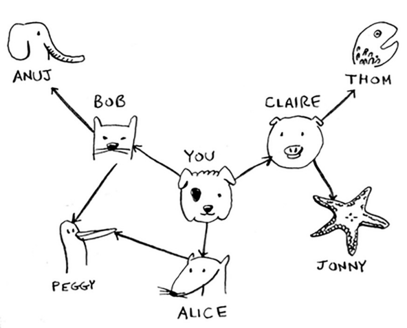
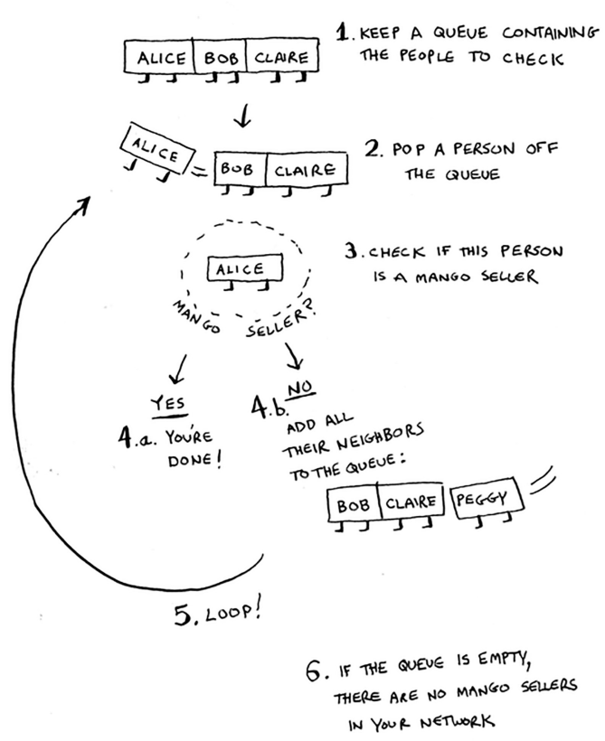
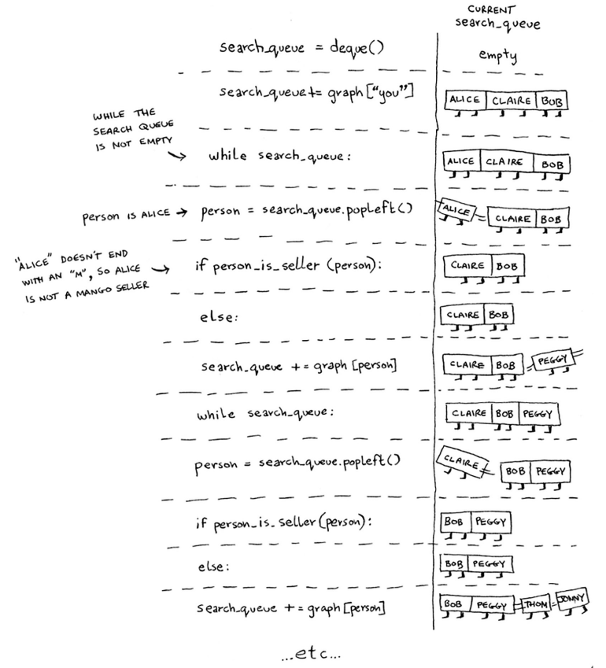

Graphs + Breadth-first search
=====

Breadth-first search allows you to find **the shortest distance between 2 values.**

.. Important:: The problem indicated above is known as a **shortest-path problem** (how can I get from x to y in the fastest way?)**.** The algorithm that we use to solve this? This is **breadth-first search.**

To figure out how we solve the above diagram in the fastest way, there are 2 main steps:

1. Model the problem as a graph
2. Solve the problem using breadth-first search

What even is a graph? A graph is a way to **set connections.** They're made up of **nodes** and **edges**. A node can be **directly connected** to other nodes. These nodes that are connected are known as **neighbors.** 

The 2 questions breadth-first answers?

1. **Is there a path** from node A to node B?
2. **What is the shortest path** from node A to node B?

Linear programming
------------

Linear programming can be used to maximize something given the time constraints.

You're goal could be: ***given 2 meters of fabric + cotton, what's the maximum amount of shirts and pants that I can make to maximize profit?***

These aren't direct answers but rather a **framework for thinking.**  

This is quite similar to graph algorithms (actually linear programming is the greater subset for graphs)

Queues
------------

The way we'd organize through different hierarchies (levels) of nodes are through **queues.** They're similar to stacks but you can only perform 2 operations: **enqueue** and **dequeue.**

It works in **FIFO structure;** first in, first out. Notice how as the 4 is added, the 1 is automatically removed.

The main concern people face is, *How do you express relationships (nodes)?* We can do this through **hash tables.**

For example, with the diagram below:

.. code-block:: python
   :linenos:

   graph = {}
   graph[“you”] = [“alice”, “bob”, “claire”]
   graph[“bob”] = [“anuj”, “peggy”]
   graph[“alice”] = [“peggy”]
   graph[“claire”] = [“thom”, “jonny”]
   graph[“anuj”] = []
   graph[“peggy”] = []
   graph[“thom”] = []
   graph[“jonny”] = []

We also have something known as **directed graphs.** This is essentially when one of the nodes don't connect to anything else (Anuj, Peggy, Jonny, Thom).

So to recap, here's what the overall implementation looks like:

.. code-block:: python
   :linenos:

   # A use case of this for "mango" sellers

   from collections import deque
   search_queue = deque()
   search_queue += graph[“you”]

   def person_is_seller(name):
	return name[-1] == ‘m’

   while search_queue:
	person = search_queue.popleft()
	if person_is_seller(person):
		print person + “ is a mango seller!”
		return True
	else:
		search_queue += graph[person]
   return False

.. code-block:: python
   :linenos:

   def search(name):
	search_queue = deque()
	search_queue += graph[name]
	searched = []
	while search_queue:
		person = search_queue.popleft()
		if not person in searched:
			if person_is_seller(person):
				print person + “ is a mango seller!”
				return True
		else:
			search_queue += graph[person]
			searched.append(person)
	return False

Note that the running time for this algorithm will be **atleast O(n)** because we search through and follow each edge.

.. Important:: "*Breadth-first search takes O(number of people + number of edges), and it’s more commonly written as O(V+E) (V for number of vertices, E for number of edges)."*

