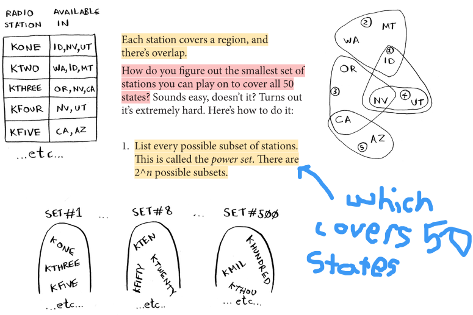

Greedy algorithms
=====

It's pretty straightforward: **at each step you pick the locally optimal solution, and in the end you’re left with the globally optimal solution.**

They're also super simple to write and usually hit the solution.

The set-covering problem
------------

"Suppose you’re starting a radio show. You want to reach listeners in all 50 states. You have to decide what stations to play on to reach all those listeners. It costs money to be on each station, so you’re trying to minimize the number of stations you play on. You have a list of stations."

What's the problem? **It takes an extremely long time to calculate every single possible subset.** The running time is **O(2^n)**, it's WAY TOO SLOW. That would be at least **15 years to figure this out** (assuming that you calculate 10 subsets/second)**!**

How can we solve this with greedy algorithms?

1. Pick the station that covers the most states that haven’t been covered yet. It’s OK if the station covers some states that have been covered already. 
2. Repeat until all the states are covered.

What we're using is something known as an **approximation algorithm.** Calculating the exact solution takes way too long.

How do we judge the algorithm?

1. How fast they are 
2. How close they are to the optimal solution

What makes greedy a good choice? It has an **O(n^2) running time** while being able to have high running speeds.

.. code-block:: python
   :linenos:

   states_needed = set(["mt", "wa", "or", "id", "nv", "ut", "ca", "az"])
   arr = [1, 2, 2, 3, 3, 3]
   stations = {}
   stations["kone"] = set(["id", "nv", "ut"])
   stations["ktwo"] = set(["wa", "id", "mt"])
   stations["kthree"] = set(["or", "nv", "ca"])
   stations["kfour"] = set(["nv", "ut"])
   stations["kfive"] = set(["ca", "az"])
   final_stations = set()
   while states_needed:
	best_station = None
	states_covered = set()
	for station, states_for_station in stations.items():
		covered = states_needed & states_for_station # this is a set intersection
		if len(covered) > len(states_covered): #check whether this station covers more states then the current station, best_station
			best_station = station #update if condition is met
			states_covered = covered

>>> states_needed -= states_covered #update because the station has covered those states
>>> final_stations.add(best_station)
>>> print(final_stations)

In this example, the travelling salesman is an **NP-complete problem**; a computational problems for which **no efficient solution algorithm has been found.**
