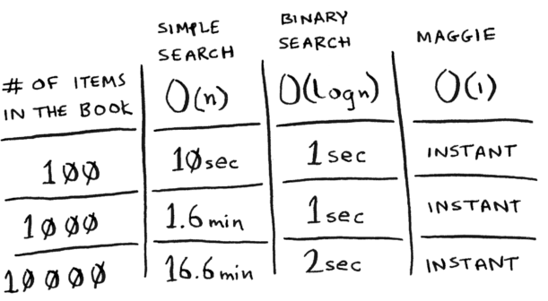
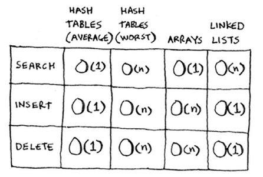

Hash tables
=====

The goal with hash tables mainly is to be able to **retrieve information about an item instantaneously.** Something that's running time is **O(1)**.

Hash functions are essentially when you **input a string** and are returned **a number.** Think of it as a way to map from strings to numbers.

Why does this work?

1. Hash functions consistently **map a name to the same index (value)**
2. Hash functions **map different strings to different indexes.**
3. Hash functions **know how big your array already is** and can only return valid indexes.

Everything, as described above, is known as a **hash table.**

Other common names include: **hash maps, maps, dictionaries, and associative arrays.**

Common use cases generally include: **lookups, translation, correlation, preventing duplicate entries, and in cache.**

Sometimes, what happens is that whenever we bin values together (alphabet words), we end up with 2 or more words that fall under the same index. **This is known as collision.** (2 keys have been assigned the same slot)

The simplest solution used right now is to use **linked lists**. But there's a problem here; if you're data is not evenly distributed i.e. only one node has the majority of lists, **you're going to slow down your table.**

What do you do? **Create a proper hash function that maps the keys evenly throughout the hash.**

Running time
------------

Hash tables run in **O(1) time aka constant time** (which means instantaneously)**.** Your worst case is O(n) time.

It's important you don't hit worst-case scenarios when working with hash tables. To do that, you need to **avoid collisions.** To do that, you need: **a low load factor and a good hash function.**

The load factor is essentially the **Number of items in hash table / total number of slots.**

Ex. if I had a hash table with length 5 and I've filled in 2 slots, then my load factor is: **2/5 = 0.4**

When your load factor starts to grow, you need to add more slots to your hash table. This is generally known as **resizing.**

**Quick note:** lower load factors lead to fewer collisions + results in increased performance. A rule of thumb mentioned in the book is to resize whenever the **load factor ≥ 0.7.**

Yes, averaged out, hash tables will still take only O(1) for resizing