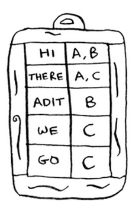

Inverted indexes
=====

Let's say that we have 3 web pages with this content:

From there, let's build a hash table from that:

Now let's say that the user *searched for **there.*** Now we easily know that we can **display pages A and C.** We're essentially creating a **hash that can map words to places where they appear (web pages).** This is exactly what inverted indexes are.
