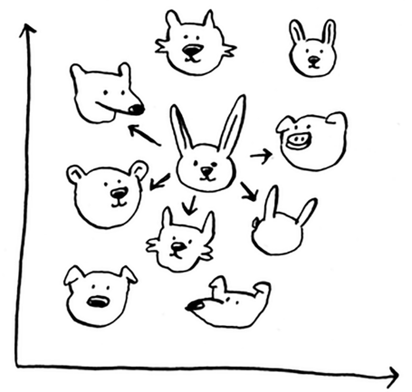

k-Nearest Neighbors
=====

.. _listsarrays:

Generally, the main intuition behind KNNs are finding the **closest neighbor** of a point when graphed out.

On a high level understanding, Netflix's algorithm also works like this!

Generally, users are plotted out based on similarity so whenever you get recommended movies, Netflix **looks at the people who share similar taste and choose a movie that'll appeal to you.**

The way you figure out the similarity will be through the **features you choose to filter by** (feature extraction). The way we find the distances between two [or more] points can be through the **Euclidian distance** (aka Pythagorean formula):

.. math::
    $\sqrt{(x_1-x_2)^2+(y_1-y_2)^2}$

With KNNs, there are 2 main things you can do: **classification, and regression.** In this case, above we did classification i.e. classifying genres of similar movies, but regression is super useful as well.

The main question right now is **"how do I chose the right features to compare against?"** 2 things:

1. Features that directly correlate to the movies you’re trying to recommend
2. Features that don’t have a bias (for example, if you ask the users to only rate comedy movies, that doesn’t tell you whether they like action movies)

Additionally, this can also fall into Machine Learning algorithms. By selecting accurate + extracting relevant features, you can determine its nearest neighbors to make an accurate prediction.