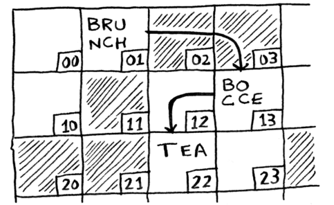
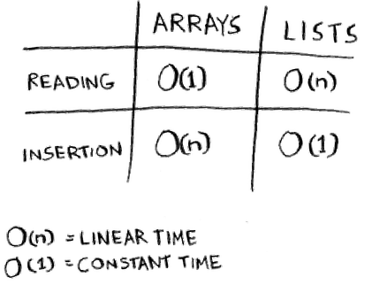
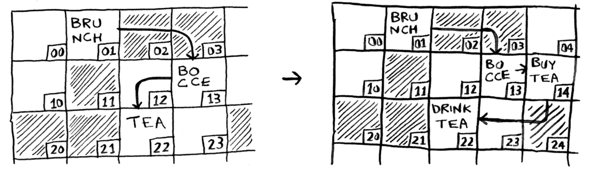
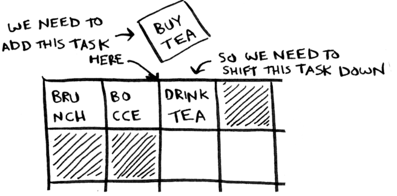
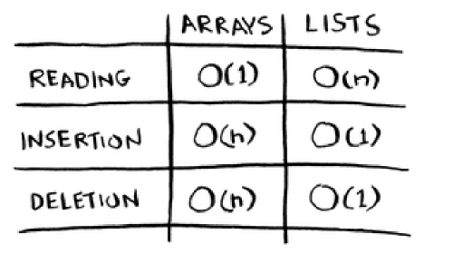

Lists + Arrays
=====

.. _listsarrays:

Think of your computer as a giant set of drawers with each drawer having an address.

Every time you want to store an item in memory, you generally will ask the computer for some space (drawers). It then returns an address where you can store your items. 

The 2 ways we store multiple items right now are **arrays and lists.** 

Adding items every single time to an array is very difficult. Think of it like the movies: if you sit with your friends and a friend shows up [but there are no spots for them], you have to move everyone to a new row. And what happens if another one shows up? **You have to move again!**

Adding an item to a computer is very slow. The easiest way we solve this is through "holding seats." **Even if you have only 3 seats, you can ask the computer for 10 slots, just in case.**

The main problem with doing something like this is mainly the fact that you have extra slots that you might've asked for but  haven't used. On the other hand, **you might have more than 10 items and would have to move anyway.**

We can solve this through the principle of **Linked Lists.**

Each item stores the address of the next item in the list. A bunch of random random memory addresses are linked together.

Adding an item to this linked list is quite easy; **you just simply stick it anywhere in the memory and store the address with the previous item. This allows you to never have to move your items**

If linked lists are better than arrays (above), what would the purpose of arrays even be?

The problem with lists
------------

The problem with linked lists is that, "***if you're going to keep jumpig around, linked lists are terrible. Why? If I wanted to get to the last item in a linked list, I have to go through EVERY SINGLE ITEM because that's what gives me the address to get to the next item."***

Arrays are different. You actually are given the address for every single item in the array.

In this case, you'd use an array when you want to **read random elements because you can look up any element in the array.**

Why does it take O(n) time to insert an element into an array?

Insertion
------------

Generally with lists, insertion is quite easy. You just simply change the address the previous element points to.

But in the case of an array, you need to shift all the elements down.

**Verdict: lists are generally better when it comes to inserting elements into the middle.**

Deletion
------------
**Again, lists are better.** You simply just change what the previous element points to while with arrays, everything needs to be moved up when you delete the element.

Arrays vs lists?
------------

Arrays are generally used more because they can allow for **random access**. 

We generally have 2 types of access: **random access** and **sequential** [one by one] **access.** Linked lists can only do sequential access while random allows you to jump directly to your desired element.

