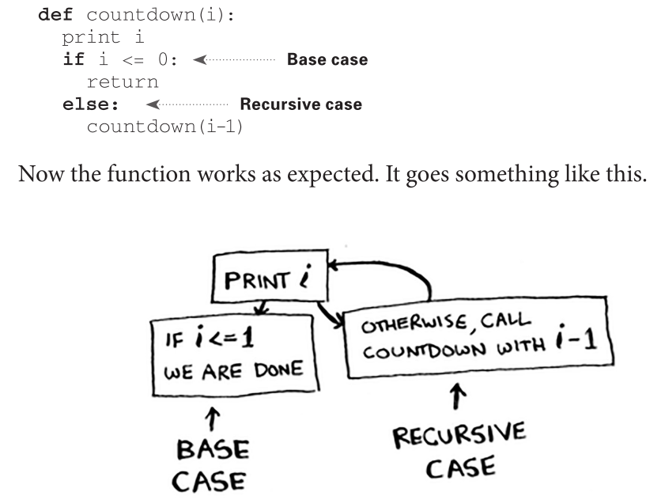
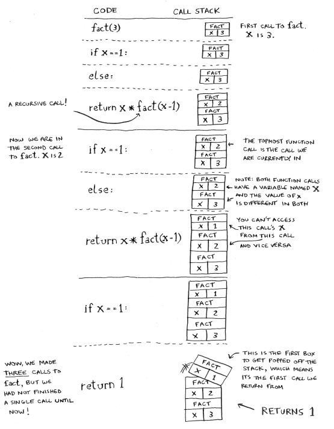
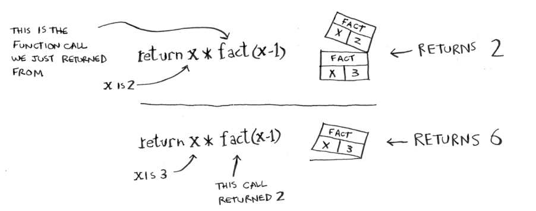

Recursion
=====

It's essentially a function that calls itself:

.. code-block:: python
   :linenos:
   
   def look_for_key(box):
      for item in box:
          if item.is_a_box():
             look_for_key(item)
	  elif item.is_a_key():
	     print(“found the key!”)

Recursion is generally used when it makes the existing solution a lot clearer and easier to understand.

**There is no performance benefit to using recursion!** In fact, loops may sometimes be better for performance.

.. Important:: “Loops may achieve a performance gain for your program. Recursion may achieve a performance gain for your programmer. Choose which is more important in your situation!”

.. _problem:

The problem with recursion?
------------

**You might get stuck in an infinite loop.**

That's why most recursive functions have a **"recursive case"** so that function knows when to stop calling itself.

Computers generally use a stack known as the **call stack.** When you call on a function, your computer allocates a box of memory for that function call with "sub-boxes" for variable names.

Now, every time you make a function call, your computer saves the values for all the variables in that "box".

.. Attention:: "When you call a function from another function, the calling function is paused in a partially completed state."

The values of that function are stored in memory but they're instead **put on pause.**

Code
----------------

Recursive functions can also use this call stack as well. A perfect example of this is in **factorials.**

.. code-block:: python
   :linenos:
   def fact(x):
      if x == 1:
          return 1
      else:
          return x * fact(x-1)

>>> fact(5)
120

The problems with call stack
----------------

What's the main problem with saving everything on the call stack? **It takes up A LOT of memory.** When your stick is too tall, that means your computer is saving information for many function cells.

2 things you can do:

1. Rewrite your code to use a loop isntead
2. Use something known as **tail recursion. (only supports some languages)**
