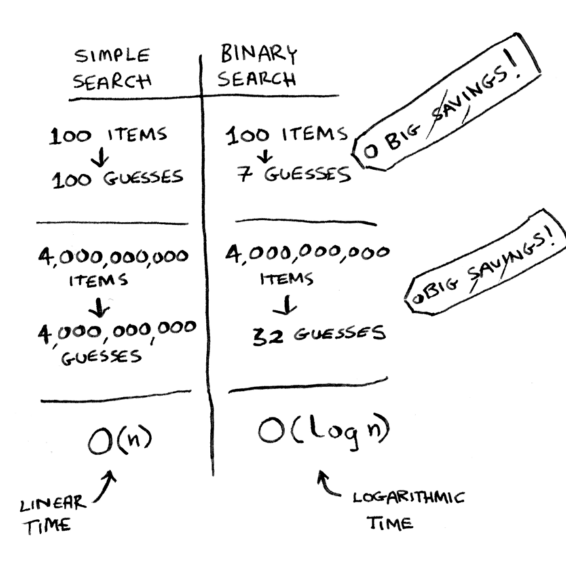
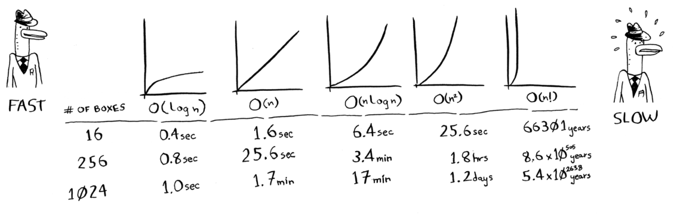

Running time
=====

Whenever the maximum amount of guesses is equal to the size of the list, we generally define this to be **linear time**

Whenever we want to determine how fast an algorithm is, we generally use something known as **Big O Notation.**

.. Important:: That’s why it’s not enough to know how long an algorithm takes to run—you need to know how the running time increases as the list size increases.

Big O Notation tells you how fast an algorithm is. For example, let's say that you have a list of size ***n.*** The run time in Big O Notation is ***O(n)***. 

Notice that Big O Notation doesn't ask for the speed in seconds.  **Big O notation lets you compare the number of operations. It tells you how fast the algorithm grows.**

What does that look like for Binary search? **O(log_2_n)**

**Note:** Big O Notation establishes a **worst-case run time.** The worst case is that you iterate through every element until you find the desired one, the worst case is that you have to apply binary search indefinitely until you find your desired element.

Here are some common Big O Run Times:

   +----------------------+-----------------------------------------------+------------------------------------+
   | **Big O Notation**   | **Known as**                                  | **Examples**                       |
   +----------------------+-----------------------------------------------+------------------------------------+
   | O(log_n)             | Log time                                      | Binary search                      |
   +----------------------+-----------------------------------------------+------------------------------------+
   | O(n)                 | Linear time                                   | Simple search                      |
   +----------------------+-----------------------------------------------+------------------------------------+
   | O(n*log_n)           | Fast sort algorithm                           | Quicksort                          |
   +----------------------+-----------------------------------------------+------------------------------------+
   | O(n^2)               | Slow sorting algorithm                        | Selection sort                     |
   +----------------------+-----------------------------------------------+------------------------------------+
   | O(n!)                | Really slow sorting algorithm                 | Travelling salesperson!            |
   +----------------------+-----------------------------------------------+------------------------------------+

