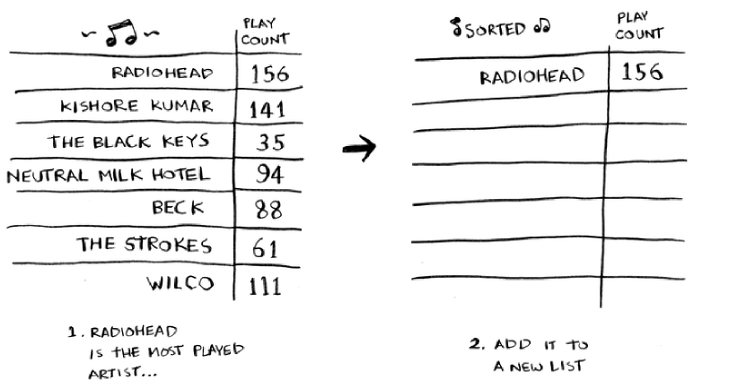
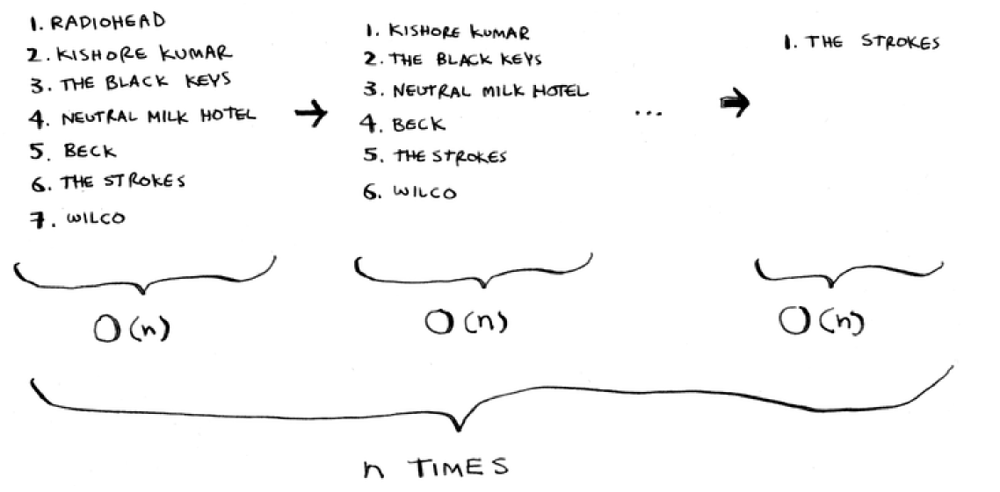

Selection sort
=====

.. _music:

Music!
------------

Let's say that I'm sorting music

I go from choosing the most played songs all the way down to the least. I start off with my original list and then append all of that (in ordered form) to this new list.

As we do this over and over again, every single time, this overall process ends up taking **O(n*n) or O(n*2) time**

Selection sort is quite neat, but not really that fast. Quicksort is a lot fast, it only takes **O(n log n) time!**

Code
----------------

.. code-block:: python
   :linenos:
        def findSmallest(arr):
	        smallest = arr[0]
	        smallest_index = 0
	        for i in range(1, len(arr)):
	                  if arr[i] < smallest:
			  smallest = arr[i]
			  smallest_index = i
	        return smallest_index
        def selectionSort(arr):
	        newArr = []
	        for i in range(len(arr)):
	                smallest = findSmallest(arr)
		        newArr.append(arr.pop(smallest))
	        return newArr
>>> print selectionSort([5, 3, 6, 2, 10])
[2, 3, 5, 6, 10]

