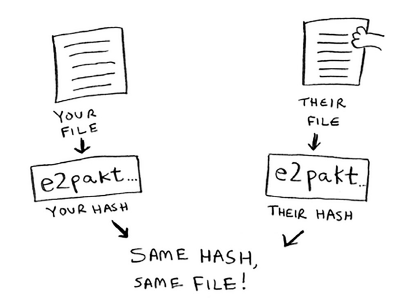

SHA algorithms
=====

SHA (**Secure hash algorithms**) convert an input to a hash for that string. *Note: hash's are just a short string in this context where the goal is string→string.*

SHAs can be used in situations to check the similarity of files, especially in the case of extremely large files.

Remember that this is only **one-way. If someone gets the SHA hash, they can't convert that back into the original string.**

.. Important:: "*SHA is actually a family of algorithms: SHA-0, SHA-1, SHA-2, and SHA-3. As of this writing, SHA-0 and SHA-1 have some weaknesses. If you’re using an SHA algorithm for password hashing, use SHA-2 or SHA-3. The gold standard for password-hashing functions is currently bcrypt (though nothing is foolproof)."* 

The other thing to note that is **even a single change of the character in a sting results in completely different outputs!** In the case that you a locally-sensitive hash function, you can use something like **Simhash.**